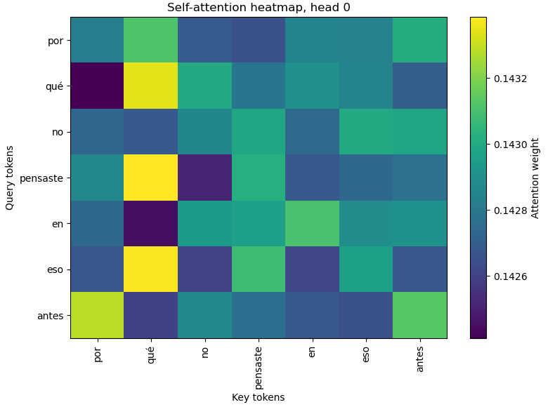

# Assignment 2: Deep Learning VT2026

Transformer-based machine translation from Spanish to English, built on top of the Keras [Neural machine translation with a Transformer and Keras](https://keras.io/examples/nlp/neural_machine_translation_with_transformer/) example.

The base code lives in [`src/Lab2_machine_translation-1.py`](src/Lab2_machine_translation-1.py) and was exported from a Jupyter notebook, so it still contains a number of `print` statements that can be cleaned up. Compared to the Keras example, the translation direction has been flipped (Spanish → English) and a few bugs that prevented the original example from running have been fixed.

## Background

The lab uses the same dataset and dependencies as the linked Keras example. You can download the dataset the same way the example does. The base code is configured for a single training epoch, which is handy while prototyping; once you are ready to record results you should increase the number of epochs. Working on a smaller subset of the data is allowed if training takes too long.

Suggested reading for Task 1 is the original [*Attention Is All You Need*](https://arxiv.org/abs/1706.03762) paper — in particular the section describing *Multi-Head Attention*. The [Keras attention MIL classification example](https://keras.io/examples/vision/attention_mil_classification/) is a good reference for how to structure a custom layer.

## Tasks

### Task 0 — Baseline

Get the example code to work as-is and record results with the base code. These numbers are the baseline that Task 1 will be compared against.

### Task 1 — Custom `MultiHeadAttention`

Implement your own `MultiHeadAttention` layer and replace `layers.MultiHeadAttention` in the transformer encoder. After swapping in your implementation, retrain the model on the same data and compare the results to Task 0.

### Task 2 — Attention visualization

Visualize the self-attention produced by your custom `MultiHeadAttention` layer and plot an attention matrix for a single sentence.

- Modify the layer to also return the attention scores and use those scores to build the matrix.
- Plotting a single head is enough.
- The resulting heatmap should look similar to the reference below.

## References

- Keras example: <https://keras.io/examples/nlp/neural_machine_translation_with_transformer/>
- Custom layer reference: <https://keras.io/examples/vision/attention_mil_classification/>
- Vaswani et al., *Attention Is All You Need*: <https://arxiv.org/abs/1706.03762>
